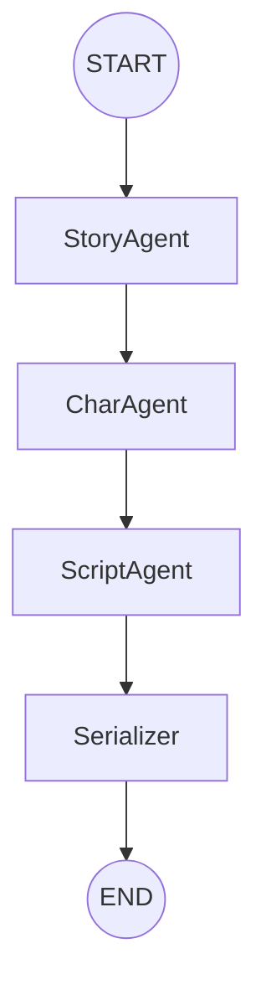

# National University of Computer and Emerging Sciences, Islamabad

## AGENTIC AI - SEMESTER PROJECT

### AI-Powered Animated Video Generation System: From Prompt to Polished Short Film

**End-to-End with LLM Agents**
**Group Size:** 4 Members | **Course:** Agentic AI | **Project Type:** Full-Stack AI System

### Submission Guidelines

- Submission deadline is 5th May (11:59 PM). Late submissions will not be accepted without prior approval.
- Each group must consist of 4 members. Cross-section groups are allowed.
- The project must be submitted by only one representative from each group on both GitHub and Google Classroom.
- Each group must create a GitHub repository containing the complete project. The repository should include:
  - A well-organized codebase structured according to all project phases.
  - A root README.md file describing the project overview, setup instructions, technology stack, and execution steps.
  - Implementation of all phases: Story and Script Generation (Phase 1), Audio Generation (Phase 2), Video Composition (Phase 3), Web Interface (Phase 4), and Edit Agent with Undo Functionality (Phase 5).
  - A requirements.txt (or equivalent dependency file).
  - Sample outputs (audio, images, or video) where applicable.
  - Unit tests for individual phases.
  - Proper commit history demonstrating incremental development.

- The repository must be public or shared with instructor access. The naming convention should follow: `AgenticAI_Project_<GroupName>`
- On Google Classroom, the submitting member must upload:
  - GitHub repository link.
  - Project report (PDF, 8-12 pages).
  - Demo video or screen recording.
  - Presentation slides (if prepared).

- The project report must include system architecture, phase-wise implementation details, tools and APIs used, JSON schema design, challenges faced, results, and individual contributions.
- The demo video (3-7 minutes) must clearly demonstrate the full pipeline from prompt to final video, along with at least three edits and two undo/revert operations through the editing agent.
- All submissions must be original. Any form of plagiarism will result in zero marks.
- Incomplete repositories, missing components, or non-functional pipelines will be penalized. Each phase should be modular, properly integrated, and independently testable.
- Students are strongly advised to finalize the shared JSON schema at the beginning, as it is critical for integration across all phases.

---

### 1. Project Overview

This project challenges your group to build an end-to-end, agent-orchestrated system that accepts a single natural-language prompt from a user and autonomously produces a complete short animated video — including story, dialogue, character voices, visual scenes, and final composited output with zero manual creative intervention. The system is not a simple API wrapper. It is a multi-phase agentic pipeline where each phase is a distinct AI-powered module with defined inputs, outputs, and responsibilities. The four phases map directly to the four group members, and the entire pipeline is unified by a web interface that orchestrates, monitors, and allows re-running of individual phases.

### 2. Problem Statement

Creating even a short, animated video today requires a team of writers, voice artists, illustrators, animators, and audio engineers — a process that takes days or weeks and costs thousands of dollars. The rise of generative AI models across language, audio, and vision domains makes it theoretically possible to automate this entire pipeline, yet no student-accessible, open-source, end-to-end solution exists that ties all of these components together with an intelligent orchestration layer. This project solves exactly that problem. Your group will design and implement:

- An LLM-based creative agent that turns a raw user prompt into a structured, scene-by-scene story with full character definitions.
- A voice synthesis module that assigns consistent, character-specific voices and produces a synchronized audio track with background music.
- A visual generation and composition module that produces per-scene imagery, animates it, syncs it with audio, and exports a final MP4.
- A full-stack web application that serves as the user-facing interface and the agent orchestration layer for all pipeline phases.
- An intelligent editing agent that interprets free-text edit commands, detects the target component (audio, video frame, or full video), executes the change, and maintains a versioned state history with full undo support.

### 3. Learning Objectives

Upon completing this project, each group member will have demonstrated the ability to:

1. Design and implement a multi-agent workflow using LangChain and/or LangGraph.
2. Integrate heterogeneous AI APIs and local models within a single production pipeline.
3. Apply structured output techniques (JSON schema enforcement, prompt chaining) with LLMs.
4. Build a real-time, phase-aware full-stack web application.
5. Handle stateful, versioned data across an agentic pipeline (including undo/revert logic).
6. Collaborate on a modular codebase with clearly defined inter-phase contracts (data schemas).

---

### 4. System Architecture

The system consists of five modules. The first four are core pipeline phases; the fifth is the editing agent. All modules communicate through a shared data schema — a central JSON state object that is passed forward, updated, and versioned by each phase.

**Phase 1: Story, Script & Character Design**

| Field              | Details                                                                                                                                                                            |
| :----------------- | :--------------------------------------------------------------------------------------------------------------------------------------------------------------------------------- |
| **Input**          | A free-form natural language prompt from the user (e.g., "A young astronaut discovers a hidden ocean on Mars")                                                                     |
| **LLM Role**       | Expand prompt to full narrative scene-by-scene script with dialogue, setting, tone, and duration; character roster with names, roles, voice personalities, and visual descriptions |
| **Output**         | A validated JSON object: `{ story, scenes[], characters[] }` consumed by all downstream phases                                                                                     |
| **Tools/APIs**     | LangChain/LangGraph agent; local model via Ollama/llama.cpp OR cloud API (Claude/GPT-4); Pydantic schema validation                                                                |
| **Responsibility** | Member 1                                                                                                                                                                           |

**Phase 2: Audio Generation & Integration**

| Field              | Details                                                                                                                                                                         |
| :----------------- | :------------------------------------------------------------------------------------------------------------------------------------------------------------------------------ |
| **Input**          | `scenes` and `characters` from Phase 1 JSON                                                                                                                                     |
| **Tasks**          | TTS synthesis per dialogue line with per-character voice parameters; background music selection or generation per scene mood; assembly of audio segments into a timing manifest |
| **Output**         | Audio files `(.wav/.mp3)` per line + a `timing_manifest.json` (`{ scene_id, audio_file, start_ms, end_ms }`)                                                                    |
| **Tools/APIs**     | ElevenLabs API (cloud) or Coqui TTS / Bark (local); optional MusicGen or royalty-free library for BGM                                                                           |
| **Responsibility** | Member 2                                                                                                                                                                        |

**Phase 3: Video Generation & Composition**

| Field              | Details                                                                                                                                                                                                                                                 |
| :----------------- | :------------------------------------------------------------------------------------------------------------------------------------------------------------------------------------------------------------------------------------------------------ |
| **Input**          | `scenes[]` from Phase 1 JSON + `timing_manifest.json` from Phase 2                                                                                                                                                                                      |
| **Tasks**          | Per-scene image generation using prompt-engineered visual descriptions; light animation (zoom/pan/Ken Burns) via FFmpeg or MoviePy; A/V sync using timing manifest; subtitle overlay (optional); compositing all scenes with transitions into final MP4 |
| **Output**         | `final_output.mp4` the finished animated short video                                                                                                                                                                                                    |
| **Tools/APIs**     | Stable Diffusion (local via Automatic1111/ComfyUI) or DALL-E / RunwayML (API); FFmpeg; MoviePy                                                                                                                                                          |
| **Responsibility** | Member 3                                                                                                                                                                                                                                                |

**Phase 4: Deployment & Web Interface**

| Field              | Details                                                                                                                                                                 |
| :----------------- | :---------------------------------------------------------------------------------------------------------------------------------------------------------------------- |
| **Input**          | User prompt (initiates pipeline); phase outputs from Phases 1–3                                                                                                         |
| **Tasks**          | Provide a prompt input UI; display real-time per-phase progress; offer phase-level re-run buttons (e.g., regenerate voice only); serve final video preview and download |
| **Output**         | A deployed full-stack web application                                                                                                                                   |
| **Tools/APIs**     | FastAPI or Django (backend); React or Next.js (frontend); WebSocket or SSE for live progress; Docker (optional for deployment)                                          |
| **Responsibility** | Member 4                                                                                                                                                                |

---

### Page 5 Diagram Conversion: Text & Code Representation

#### Text Description of the Workflow

The agent workflow begins at **START** and flows sequentially through three main agents, ending with output generation. An **Error Handler** oversees the whole process, enabling retry loops for the agents if they fail.

1. **Story Agent:** Generates a `StoryOutput` (intro, climax, resolution).
2. **Character Agent:** Produces a `CharacterRoster` (voice and appearance profiles).
3. **Script Agent:** Produces `ScriptOutput` (dialogue, visuals, timing).
4. **Output Artifacts (`serializer.py`):** Generates:
   - `story.json`
   - `characters.json`
   - `script.json`
   - `phase2_audio_handoff.json`
   - `phase3_video_handoff.json`
   - `summary.json`

5. Flow ends at **END**.

#### Mermaid.js Representation



---

### 5. Last Phase - Intelligent Edit & Undo System

After the pipeline produces its initial output, the user should be able to describe edits in plain natural language. The system must detect the target (audio, video frame, or full video), execute changes, and allow reverting to previous states.

#### 5.1 What the User Can Say

Examples include:

- Change voice tone
- Make scene darker
- Add background music
- Remove subtitles
- Change character design
- Speed up scene
- Regenerate script

#### 5.2 Intent Detection

The system outputs structured intent like:

```json
{ "intent": "change_voice_tone", "target": "audio" }
```

Targets include: audio, video_frame, video, script.

#### 5.3 State Versioning & Undo

- Every output creates a snapshot
- Versions tracked (v1, v2, v3...)
- Users can revert any state
- Stored via SQLite or file-based logs

---

### 6. Division of Work

| Member   | Phase       | Responsibility   |
| :------- | :---------- | :--------------- |
| Member 1 | Phase 1     | Story & Script   |
| Member 2 | Phase 2     | Audio            |
| Member 3 | Phase 3     | Video            |
| Member 4 | Phase 4 & 5 | Web + Edit Agent |

---

### 7. Deliverables

- GitHub repo
- Working web app
- Unit tests
- Report
- Presentation
- Edit agent demo

---

### 8. Technology Stack Summary

| Layer    | Options                   |
| :------- | :------------------------ |
| LLM      | GPT-4 / Claude / Ollama   |
| TTS      | ElevenLabs / Coqui        |
| Image    | DALL-E / Stable Diffusion |
| Video    | FFmpeg / MoviePy          |
| Backend  | FastAPI / Django          |
| Frontend | React / Next.js           |

---

### 9. Evaluation Criteria

- Story: 15%
- Audio: 15%
- Video: 20%
- Web: 10%
- Integration: 10%
- Report: 10%
- Edit Agent: 20%

---

### 10. A Note to Your Group

This is an ambitious project. Start with Phase 1 together and finalize the JSON schema early — everything depends on it.
